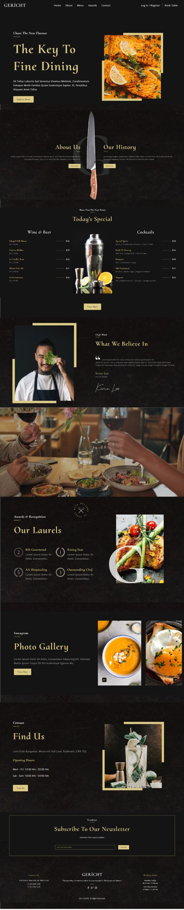

# Gerich Restaurant  
  
This project was bootstrapped with [Create React App](https://github.com/facebook/create-react-app).  
I installed react-icons as a dependency.  
I built it from a tutorial of the YouTube channel -- _JavaScript Mastery_.  
The channel provided about 23 images and a video as assets, imported locally, and a Figma design.  
  
The mock restaurant webpage is responsive and was made with about sixteen function components.  
  
  
  